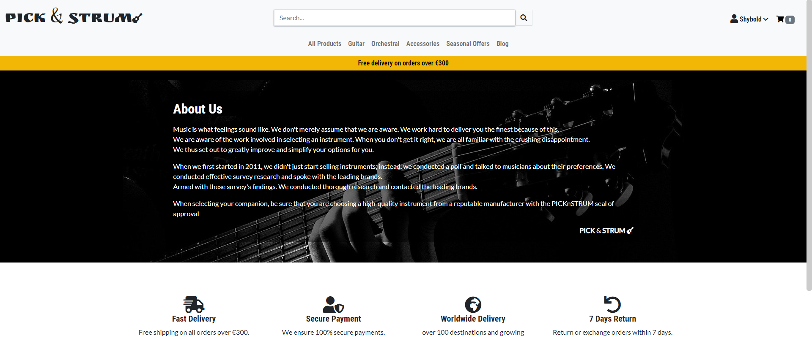
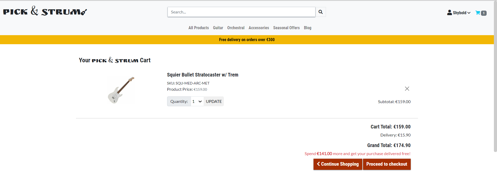
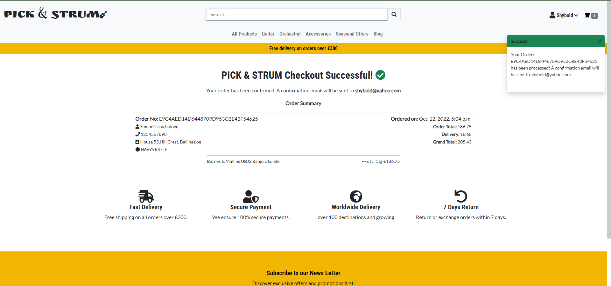
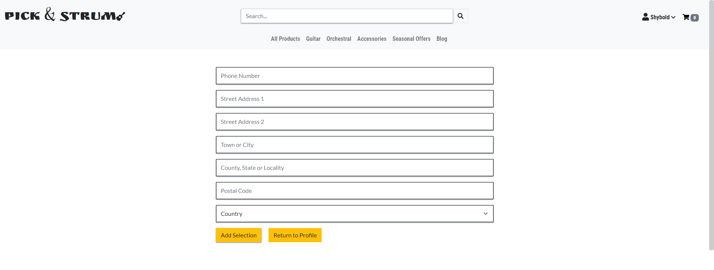
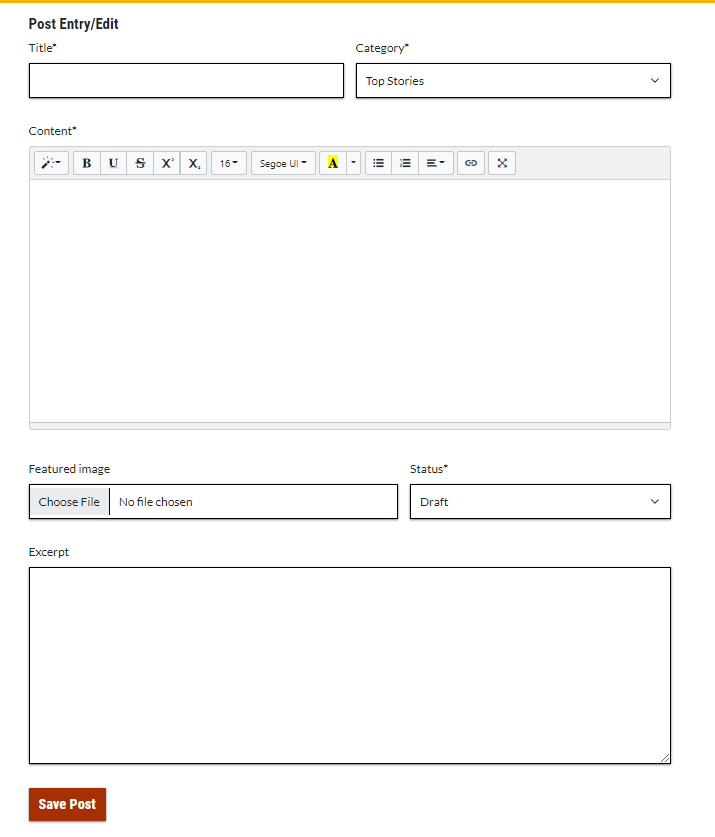

# Pick & Strum
Pick&Strum is a specially designed website application for a business that sells stringed instruments, including anything from guitars to violins, and related accessories. It is intended to provide users with a secure and simple experience. This project was created utilizing the Django framework and supporting languages in Python, HTML, CSS, JavaScript, as well as other libraries like Crispy, Summernote Allauth and Stripe.

## Table of Content

- [Responsiveness](#responsiveness)

- [Site Scope](#site-scope)
    * [user stories](#user-stories)

- [Site Features](#site-features)
    * [Site Navigation](#site-navigation)
    * [Features left to implement](#features-left-to-implement)

- [Database Model](#database-model)

- [Wire Frame](#wire-frame)

- [Language, Framework, Library and Tools](#language-framework-library-and-tools)

- [Testing](#testing)

- [Bugs](#bugs)

- [Deployment](#deployment)

- [Credits](#credits)

- [Acknowledgment](#acknowledgment)

- [Disclaimer](#disclaimer)

<details>
<summary>Dropdown Heading</summary>
<br>
Choice 1
<br> Choice 2
<br> Choice 2
<br>
</details>

## Responsiveness:
The site is responsive and can be easily accessed with full functionality in full screen, tablet and mobile screen


## Site Scope
* Responsive Design: Pick&Strum website should be fully responsive in all devices from screen size 280 upwards
* No loss to functionality between mobile devices and tablets or desktops
* Site user can view products and blog post.
* Site users can make purchase without need to create an account.
* Site users can view blog post and intaract by liking or disliking post.
* Site users can create a personal account and save and view thier order history
* Site Users can update thier data and review product they have purchased.
* Restrictions to key site features unless site user is registered and logged in
* Logged in users’ ability to perform full CRUD functionality to their profile and reviews posted on the site
* Logged in users ability to interact with posts in the blog section

### User stories
| As a...                | I can...                                                 | So I can...                                                                 |
| :------------          |   :------------------------                              |        :--------------------------                                          |
|As a user               | I can see all products           |  so that I can select some to purchase.                                          |
|As a user               | I can view individual products                          |so that I can see the rating, details, specifications, price, quantity
|As a user                |I can easily identify deals and clearance               |so that I can benefit from the deals and promotions
|As a user               |I can search for a product by name or category           |so that I can find a product easily and quickly
|As a user               |I can sort available products in order of prices or brand |so that I can make informed decision and manage purchase and expense parameters
|As a user               |I can add items I want into a bag                        |so that I can easily add or remove items
|As a user                |I can view the total of my purchase                       |so that I can make informed decision on how much I am spending
|As a user                  |I can view list of posted blogs                        |so that I can select and read any one I like
|As a user                  | I can click on a post                                  |  so that I can read the full post.
|As a user             |I can easily register an account                       |so that I will be able to view my profile
|As a user             |I can Easily Login and Logout                          |so that I can access my personal information
|As a user             |I can easily recover my password                       |so that I can log back into my profile
|As a user             |I can have a personalized user profile                 |so that I can view my order history update my user profile and save my payment confirmation
|As a user             |I can Subscribe to sites newsletter                    |so that I can receive informative newsletters and benefit from any deals available
|As a user               |I can save purchase history to my profile              |so that I can review the items and plan feature purchases
|As a user               |I can pay for products in my shopping bag securely     |so that I can feel safe and confident using my card on the site
|As a Site Admin        |I can view a data entry form                           |so that I can add, update and delete products and posts


[back to content](#table-of-content)

## Site Features
### Site Navigation:
Navigation bar is fully responsive and show different layout yet equal functionality in mobile and desktop site.
the company name also servers as a home button for users to get to the home page on a click.
a search bar is convinently placed in the middle for ease of use and in mobile it drops down below the navbar at a convinent line of sight .
on the right is the user account and store cart link, both icons are degined to show informations easily recognized by the user.
* The account icon hides a dropdown indicated by the down chevron arrow.
* If user is not logged in the options to register or login is shown.
* if logged in the opitins to manage store (if superuser) profile and logout is shown.

<details>
<summary>Navigation ScreenShots</summary>
<br>Site Navigation


<br>Navigation user not logged in


<br>Navigation mobile view


<br>Navigation mobile view search dropdown


<br>
</details>
<br>

### Home Page:
The site Home page features a bold statement in line with what the site offers. A call out to music lovers and an offer to assist in making that dream come through.
the home page is built around a Carousel that imtermitently changes both eye catching and informative presenting clients to the options of: shop Now, shop deals or blog post.
The Home page also have a quick find links to individual product categories and announced upcoming events.
<details>
<summary>Home Page</summary>
<br> Home Page 1


<br> Home Page 2


</details>

<br>

### Footer:
The footer section contains:
* A centrally placed newsletter form offrering exclusive first look at products
* Functional social links to social media platforms of PicknStrum. facebook, twitter, instagram.
* links to site police, contact us page and about us page

<details>
<summary>Site Footer and associated pages</summary>
<br>Footer


<br> About Us


<br> Contact Us


<br>
</details>

<br>

### Product Page:
The Product page can be accessed also by the drop down menus on the main navigation row beneath the search box.
Products are arranged in reponsive cards with informations like product name, price, category and rating.
site admin logged in also get the option to edit or delet a product.
Site uers can click and view individual product and decide to add to cart or return to the product main list.
The quantity of products selected to buy can be adjusted with the select option dropdown.
When products are added to the cart its undergoes a color change and content counter is set accordingly to the number of products inside it
Also by way of a toast message users are notified of each addition to cart.
<details>
<summary>Product Page</summary>
<br>Product List


<br>Product Detail View


<br>
</details>
<br>

### Cart:
Cart content can be viewed from toast notifications or by clicking on the cart icon
Contents can be adjusted or deleted accordingly.
<details>
<summary>Shopping Cart</summary>
<br>Cart Content


</details>
<br>

### Checkout Success:
On completing a successful payment the user is presented a summary checkout success page.
<details>
<summary>Checkout Success</summary>
<br>Payment Page


<br>Checkout Success page


</details>
<br>

### Profile:
Registered Users can login to thier profile and perform simple CRUD processes of viewing thier order history, reviewing a product purchased, updating or deleting thier review, updating thier profile and switching out thier profile pictures.

<details>
<summary>Profile</summary>
<br>Profile Pages





</details>
<br>


### Blog
The blog can be accesed from the home page main navigation and footer section.
post are organised into categories and the Top stories category is diaplayed on the page top while other posts are diplayed below.
Each post can be vewed by clicking on the post image.
Detailed post view can be intaracted with if user is logged in.

<details>
<summary>Blog Post</summary>
<br>Blog Page


<br>Detail Post page


</details>
<br>

### Management:
Admin when logged in gets a management section. Blog post can be added, edited or deleted.
Published post gain a view post link while post left in draft do not get the view post link.
Products can be added from this page also.

<details>
<summary>Management and associated pages</summary>
<br>Management Page



</details>
<br>

### Features left to implement:
* Product rating being calculated from user reviews.

 [back to content](#table-of-content)
 <br>

## Database Model
Relational Database Model was used in this project

<details>
<summary>Data Model</summary>
<br>Relational Data Model PicknStrum


</details>
<br>

[back to content](#table-of-content)
## Wire Frame
Mock up site was created using Balsamiq wireframing. individual frames can be seen [here](wireframe.md)

[back to content](#table-of-content)
<br>

## Language, Framework, Library and Tools
* HTML5 [More on HTML5 ](https://en.wikipedia.org/wiki/HTML5)
* CSS3 [More on CSS](https://en.wikipedia.org/wiki/CSS)
* JavaScript [More on JavaScript](https://en.wikipedia.org/wiki/JavaScript)
* Python [Python](https://www.python.org/) [Read More on Python](https://en.wikipedia.org/wiki/Python_(programming_language))
* Bootstarp 5 [Bootstrap](https://getbootstrap.com/)
* Django [Django](https://www.djangoproject.com/)
* Psycopg2 [PostgreSQl](https://www.postgresql.org/)
* Django-allauth [django-allauth read the doc](https://django-allauth.readthedocs.io/en/latest/)
* Crispy-form [django-crispy-form read the doc](https://django-crispy-forms.readthedocs.io/en/latest/install.html)
* Summernote [Summernote Docs](https://summernote.org/)
* Balsamiq [more on Balsamiq](https://balsamiq.com/)
* Heroku [more on Heroku](https://devcenter.heroku.com/)

[back to content](#table-of-content)

## Testing
Deployed site was tested Manually and codes where validated online [go to test page](test.md)

[back to content](#table-of-content)

## Bugs
* Blog page will throw error if ```blog_category.json``` fixtures are not loaded as the category "Top stories" is essential to the page

[back to content](#table-of-content)

## Deployment
The steps in deployment is recorded [here](deployment.md)

[back to content](#table-of-content)

## Credits
* Code Institute [Code Institute](https://codeinstitute.net/ie/)
* Django Doc [read the doc](https://docs.djangoproject.com/en/4.0/)
* Pixabay for the images used on the site [Pixabay](https://pixabay.com/)
* Ukachukwu Sherifat [@Nurse_Ukachukwu](https://twitter.com/nurse_ukachukwu) for external user testing.

[back to content](#table-of-content)

## Acknowledgment
* Code Institute Tutor Assistance
* Caleb Mbakwe Mentor
* Sherifat and Olivia for all the love and support

[back to content](#table-of-content)

## Disclaimer
This site was developed for educational purposes only. _Samuel Ukachukwu 22/06/2022_
